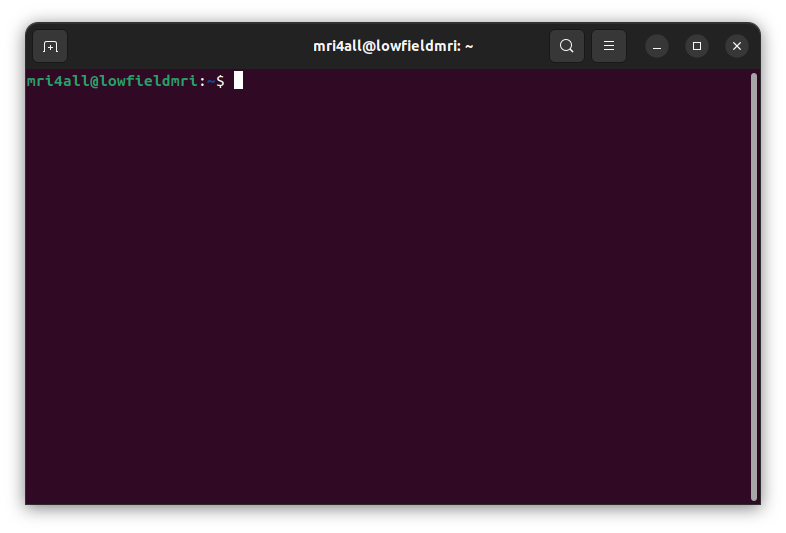
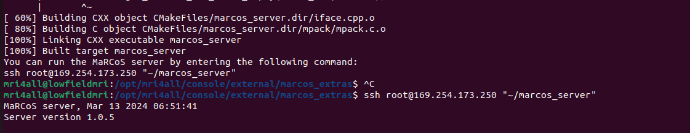
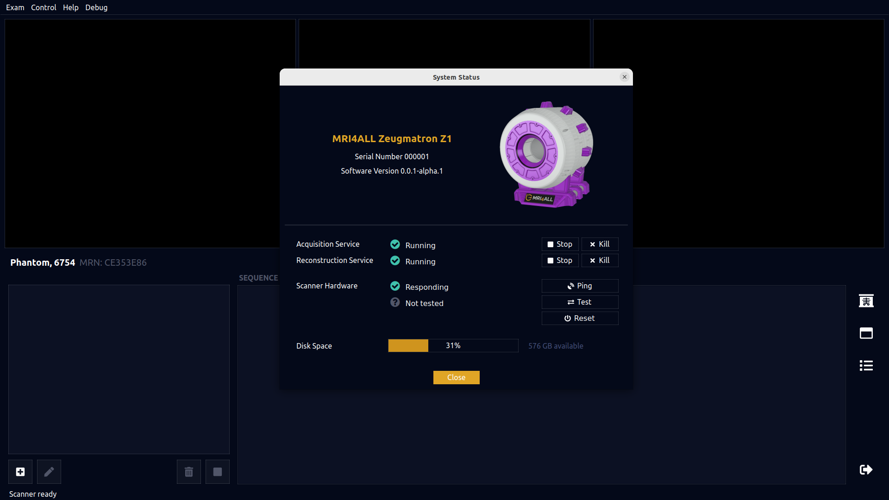
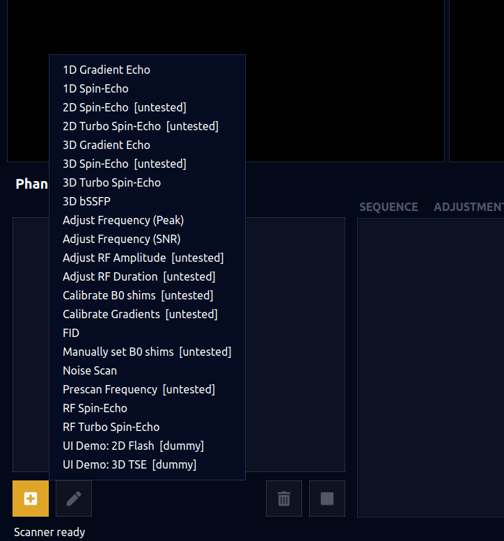
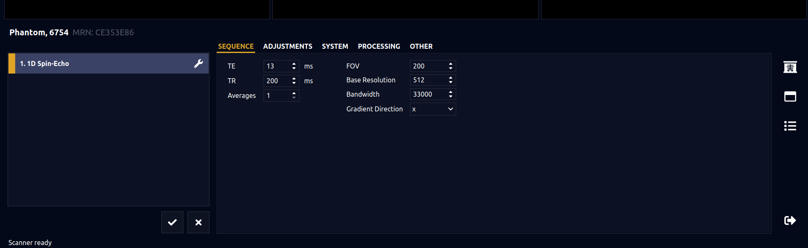
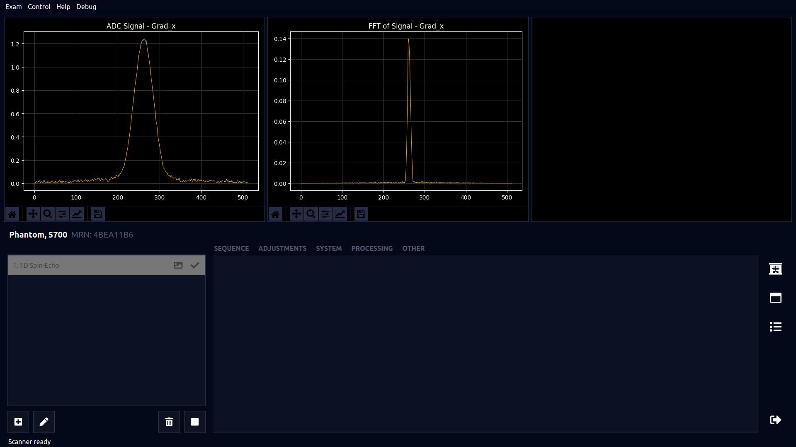
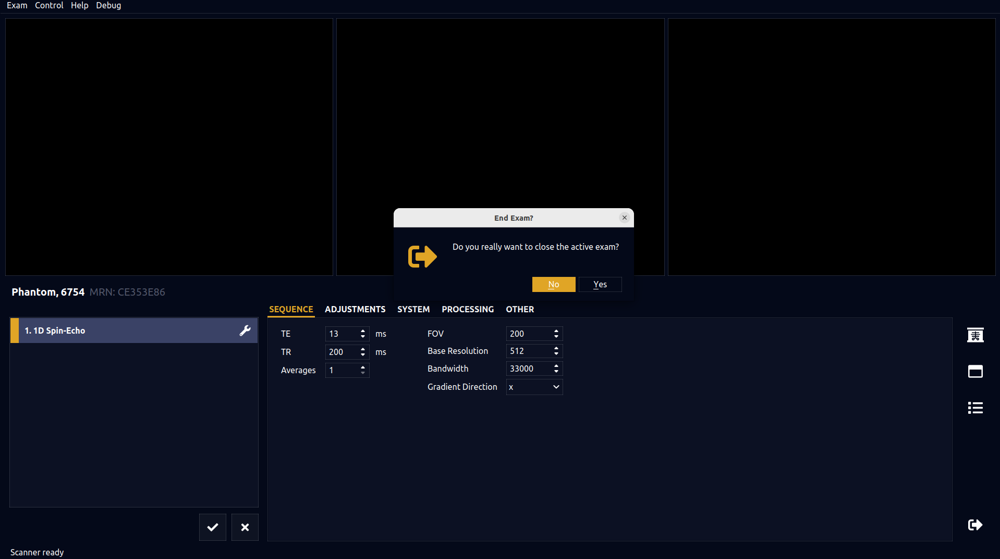
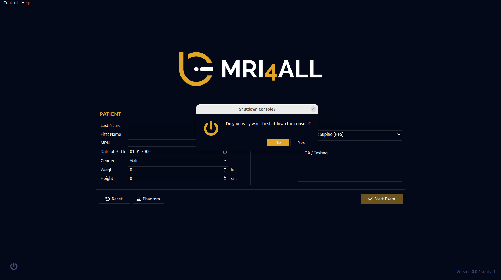

# mri4all SOPs
## The Standard Operating Procedure for the Low-Field MRI in Uganda

## Table of Contents
- [Intro](#intro)
- [Acknowledgement](#acknowledgement)
- [Switching on the system](#switching-on-the-system)  
- [Logging in on the console screen](#logging-in-on-the-console-screen)
- [Running the console software](#running-the-console-software)
- [Shutting down](#shutting-down)

## Intro
In the following text, a brief and intuitive set of instructions or as put the standard operating procedure of the table-top MRI at MRI-Uganda explains the guidelines to follow from turning on the system to imaging and activities after imaging.

These are directed to everyone responsible to take images on the console computer here at MRI-Uganda.

For more information or in case of more suggestions on how best this can be carried out, please kindly [post an issue](https://github.com/mri4all/mri4all_SOPs/issues) and it shall be responded to as soon as possible.  

## Acknowledgement
We want to thank [Dr. Sairam](https://github.com/sairamgeethanath) who has sacrificed his time to support the software team here in Uganda by sharing his knowledge with us but also providing us with all the necessary tools to enable us actually have a smooth running of the console system software. We also thank the entire open-source community of [mri4all](https://github.com/mri4all) for the great work done in open-sourcing various resources necessary in building and operating robust low field MRI equipment across continents. Finally, we thank everyone at MRI-Uganda for ensuring that the required work is also put up and for the great team-work emulated, thank you all.

## Switching on the System
This involves the turning on of the hardware components involved in our MRI imaging such as the Console computer, the various amplifiers include the transmit, the receive and the gradient amplifiers, the Red-Pitaya and the gradient board.

### Powering and Turning on the System
- Connect the Console system or PC and the Red-Pitaya on the 220V power supply
- You should as well power the transmit and the Receive amplifiers on the 12V power supply
- Power the Gradient amplifiers on the 110V power supply

## Logging in on the Console Screen

### Choose user-mri4all
- Log into the console computer as mri4all and the password should be provided by the Administrator
- When the desktop screen loads, open up the terminal, here's a hint: **ctrl + alt + t** or you can as well search for it in apps or click on the terminal to load it. This should load as follows:



- Start up the dhcp server and test its connection using the following commands:

```bash
sudo systemctl start isc-dhcp-server
sudo systemctl status isc-dhcp-server
```

- Navigate to the console directory whose path is given in the following command:

```bash
cd /opt/mri4all/console
```

- Launch the virtual environment using the following command:

```bash
source /opt/mri4all/env/bin/activate
```

The following is how the terminal should look like:


- Duplicate the terminal windows so that there are two operating windows
- On the second terminal window, once without the virtual environment opened, run the following set of commands to set up the marcos server:

```bash
cd external/marcos_extras/
./marcos_setup.sh 169.254.173.250 rp-122
ssh root@169.254.173.250 "~/marcos_server"
```

You should be able to see the following on your screen:



## Running the Console Software

- Return to the other terminal window whose virtual environment has been launched already and run the mri4all user interface using the following command:

```python
python3 run_ui.py
```

!!! warning "Caution!"
    The above command won't work if the virtual environment isn't loaded.

- When you have successfully launched the mri4all UI, choose an appropriate subject to examine and most likely you're recommended to choose **phantom** unless you have been instructed otherwise.


- Hit `Start Exam` and from `control`, check system status



- Run `test` to do a complete scanner hardware test


- Close the system status window and choose the preferred examination you are to carry out on the phantom



- For example, if 1D-Spin-Echo is chosen for the run, open the configuration tab by double-clicking on it, make necessary changes to it and run it by clicking on the check box.





- Do the above for any examination that you plan to run and you can save the graphical results to a desired directory then when you're done, close the examination.



- If you don't plan to run any other examinations, please go to `Control` and shut down the console software.



## Shutting Down

After shutting down the console software, properly power down all hardware components in reverse order.
